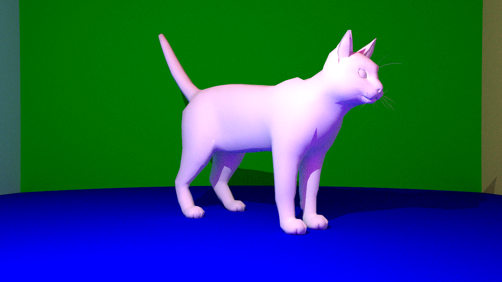

# Raytracer

Physically-based rendering is a rendering approach in which a computer attempts to accurately simulate the basic physical properties of light, material (including reflections) and shadows. Other approaches (such as those frequently used in real-time rendering applications) use fast approximations to achieve effects that trick the viewer into believing the physical accuracy of the image.

In this assignment, I have implemented a path-tracer in CUDA using the C++ API with the following features:

* Diffuse, mirror and glass surfaces, including Fresnel
* Direct lighting and shadows for point light sources
* Indirect lighting for point light sources
* Antialiasing
* Ray-mesh intersection using the bounding-box optimization

On top of this, I paid attention to the usability of the code in more general settings. This includes, in particular, loading scenes from JSON, allowing you to render different or modified scenes without recompiling the code:

* Spheres (position, radius, material, color) can be specified in an array
* Objects (position, rotation, scale, material, color) can be specified in an array by providing a path to a Wavefront file for each object. Note that texture and normal maps are not supported yet.
* Point-lights (position, intensity) can be specified in an array
* Camera parameters allow you to easily change the position and rotation of the camera, as well as the resolution (non-square resolutions are supported), field of view and number of rays.

You can refer to the [default scene](assets/scenes/default.json) for an example.

Animations can be easily achieved by changing [main.cu](src/main.cu) to iterate over a list of scene files and writing the resulting images to a folder. If you only intend on moving the camera, the `Scene` class provides simple public transformation and rotation methods you can call from `main.cu`. When rendering multiple frames, change the seed in `Scene::render` on every frame (e.g. by setting the current frame number to be the seed). This ensures there is no static noise in the video.
The application can also predict the remaining execution time.


## Dependencies

This application will only work if you have an Nvidia GPU with a 6.1 architecture. You can modify the cmake flags to compile for your architecture, but I have not tested it.

Please ensure that you have the following installed:

* latest nvidia drivers
* cuda
* tinyobjloader ([AUR](https://aur.archlinux.org/packages/tinyobjloader/), [Github](https://github.com/tinyobjloader/tinyobjloader))
* nlohmann json ([AUR](https://aur.archlinux.org/packages/nlohmann-json-git/), [Github](https://github.com/nlohmann/json))

## Build & Run

To download and compile the repository, run

```bash
git clone git@github.com:wak31415/cse306.git
cd cse306
mkdir build && cd build
cmake ..
make -j4
```

You can render the default scene with

```bash
./lab_1
```

or a custom scene with

```bash
./lab_1 ../assets/scenes/mesh_scene.json
```


## Performance

All performance benchmarks have been performed on an NVIDIA GeForce GTX 1050 mobile card. I only measured the performance of the GPU code (path-tracing), not however the host code (loading the scene and objects), which only causes a negligeable performance overhead.

32 Rays, 512x512, 5 bounces

| Type                                              | Default Scene    | Cat Scene | Factor (cat / standard)   |
| ---                                               | ---               | ---       | ---                       |
| Simple                                            | 0.05 s            | 0.37 s    | 7.4 |
| Simple + Bounding Box                             | N/A               | 0.12 s    | 2.4 |
| Antialiasing + BBox								| 0.12 s     	    | 4.14 s	| 18.0 |
| Indirect Lighting + Antialiasing                  | 0.23 s            | 59.38 s   | 258.2 |
| Indirect Lighting + Antialiasing + Bounding Box   | N/A               | 53.77 s   | 233.8 |